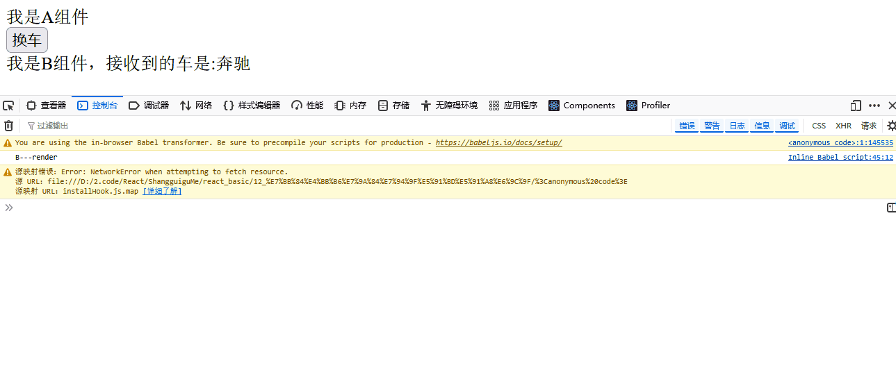
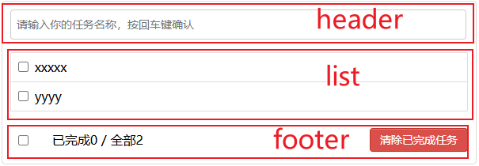

# React 笔记

## 1. React入门

### 1.1 React简介

1. 官网：
   - 中文：https://react.docschina.org/
   - 英文：[ https://reactjs.org/](https://reactjs.org/)
2. 介绍：用于动态构建用户界面的 JavaScript 库(只关注于视图)，由**Facebook**开源。
3. 特点：
   - 声明式
   - 组件式
   - React Native编写原生应用
   - 高效，优秀的Diffing算法
4. 高效的原因：
   - **使用虚拟DOM代替真实DOM操作**（jQuery中），效率高。
   - DOM Diffing算法，最小化页面重绘。


### 1.2 React的基本使用

1. 相关JS库

   > 代码：react_basic\01_hello_react\hello_react.html

   ```react
   <!-- 引入react核心库 -->
   <script type="text/javascript" src="../js/react.development.js"></script>
   <!-- 引入react-dom, 用于支持react操作DOM -->
   <script type="text/javascript" src="../js/react-dom.development.js"></script>
   <!-- 引入babel, 用于将jsx转为js -->
   <script type="text/javascript" src="../js/babel.min.js"></script>
   ```

   - react.js：React核心库。

   - react-dom.js：操作DOM的react扩展库。

   - babel.min.js：解析JSX语法代码转为JS代码的库。

     

2. Hello React：

   > 代码：react_basic\01_hello_react\hello_react.html

   ```react
   <script type="text/babel"> /* 此处一定要写babel*/
       // 1. 创建虚拟DOM
       const VDOM = <h1>Hello React</h1> /*此处一定不要写引号, 因为不是字符串*/
       // 2. 渲染虚拟DOM到页面
       ReactDOM.render(VDOM, document.getElementById("test"))
   </script>
   ```

   

3. 虚拟的DOM两种方式：

   - 纯JS代码

     > 代码：react_basic\02_虚拟DOM的两种创建方式\2_使用js创建虚拟DOM.html

     ```react
     <script type="text/javascript">
             // 1. 创建虚拟DOM
             const VDOM = React.createElement("h1", {id:"title"}, React.createElement("span", {}, "Hello, React"))
             // 2. 渲染虚拟DOM到页面
             ReactDOM.render(VDOM, document.getElementById("test"))
         </script>
     ```

   - JSX代码

     > 代码：react_basic\02_虚拟DOM的两种创建方式\1_使用jsx创建虚拟DOM.html

     ```react
     <script type="text/babel"> /* 此处一定要写babel*/
         // 1. 创建虚拟DOM
         const VDOM = (/*此处一定不要写引号, 因为不是字符串*/
             <h1 id="title">
                 <span>Hello, React</span>
             </h1> 
         )
         // 2. 渲染虚拟DOM到页面
         ReactDOM.render(VDOM, document.getElementById("test"))
     </script>
     ```

     

4. 区分虚拟DOM和真实DOM

   > 代码：react_basic\02_虚拟DOM的两种创建方式\3_虚拟DOM与真实DOM.html

   - 虚拟DOM

     ```react
     // 1. 创建虚拟DOM
     const VDOM = (/*此处一定不要写引号, 因为不是字符串*/
         <h1 id="title">
             <span>Hello, React</span>
         </h1> 
     )
     // 2. 渲染虚拟DOM到页面
   ReactDOM.render(VDOM, document.getElementById("test"))
     ```

   - 真实DOM

     ```react
     // 2. 渲染虚拟DOM到页面
     const TDOM = document.getElementById("demo")
     ```

     

### 1.3 React JSX（TODO）


### 1.4 模块与组件、模块化与组件化的理解

1. 模块与组件：复用代码，提高代码复用率。
   - **模块：提供特定功能的js程序，一个js文件就是一个模块**。
   - **组件：实现特定功能的效果的代码集合**（HTML、CSS，JS，图像等）
2. 模块化与组件化：对于整个功能划分后实现，具体区别不大。


## 2. React面向组件编程

### 2.1 基本理解与使用

1. 开发者工具：React Developer Tools，打开React网页会显示组件组成。

2. 函数式与类式组件

   - 函数式组件

     ```react
     //1.创建函数式组件
     function MyComponent(){
         console.log(this); //此处的this是undefined，因为babel编译后开启了严格模式
         return <h2>我是用函数定义的组件(适用于【简单组件】的定义)</h2>
     }
     //2.渲染组件到页面
     ReactDOM.render(<MyComponent/>,document.getElementById("test"))
     ```

     类式组件

     ```react
     //1.创建类式组件
     class MyComponent extends React.Component {
         render(){
             //render是放在哪里的？—— MyComponent的原型对象上，供实例使用。
             //render中的this是谁？—— MyComponent的实例对象 <=> MyComponent组件实例对象。
             console.log("render中的this:",this);
             return <h2>我是用类定义的组件(适用于【复杂组件】的定义)</h2>
         }
     }
     //2.渲染组件到页面
     ReactDOM.render(<MyComponent/>,document.getElementById("test"))
     ```

     

3. 组件规范：

   - 组件名必须大写。
   - 虚拟DOM只能有一个根元素，外层由`<div>`标签嵌套。
   - 虚拟DOM必须有结束标签。

4. 渲染组件标签的基本流程

   - React内部创建组件实例对象。
   - 调用render()得到虚拟DOM并解析为真实DOM。
   - 插入到指定的页面元素内部。


### 2.2 组件三大核心属性1：state

#### 2.2.1 相关基础知识复习

1. JS的类基础知识复习

   > 代码：react_basic\复习\1_类的基本知识.html

   - 构造函数constructor
   - 继承机制super
   - 静态属性

2. this指针

   > 代码：react_basic\复习\3_类方法中的this指向.html

   - 整体this指针在严格模式下为None，在非严格模式下为windows对象。
   - 类内部函数掉调用，this为实例对象。
   - 

3. 事件绑定机制

   > 代码：react_basic\复习\2_原生事件绑定.html

   ```react
   <body>
       <button id="btn1">按钮1</button>
       <button id="btn2">按钮2</button>
       <button onclick="demo()">按钮3</button>
   
       <script type="text/javascript" >
           const btn1 = document.getElementById("btn1")
           btn1.addEventListener("click",()=>{
               alert("按钮1被点击了")
           })
   
           const btn2 = document.getElementById("btn2")
           btn2.onclick = ()=>{
               alert("按钮2被点击了")
           }
   
           function demo(){
               alert("按钮3被点击了")
           }
   
       </script>
   </body>
   ```

   - DOM对象.addEventListener(响应函数)
   - DOM对象.onclick = 响应函数
   - HTML元素onlick = 响应函数

4. **state只在类式组件上起作用**.

#### 2.2.2 效果与知识点

1. 效果

   

2. 代码与知识点

   > 代码：react_basic\复习\2_原生事件绑定.html

   ```react
   //1.创建组件
   class Weather extends React.Component{
   
       //构造器调用几次？ ———— 1次
       constructor(props){
           console.log("constructor");
           super(props)
           //初始化状态
           this.state = {isHot:false,wind:"微风"}
           //解决changeWeather中this指向问题
           this.changeWeather = this.changeWeather.bind(this) // 手动为函数指定this对象
       }
   
       //render调用几次？ ———— 1+n次 1是初始化的那次 n是状态更新的次数
       render(){
           console.log("render");
           //读取状态
           const {isHot,wind} = this.state
           return <h1 onClick={this.changeWeather}>今天天气很{isHot ? "炎热" : "凉爽"}，{wind}</h1>
       }
   
       changeWeather(){
           //changeWeather放在哪里？ ———— Weather的原型对象上，供实例使用
           //由于changeWeather是作为onClick的回调，所以不是通过实例调用的，是直接调用
           //类中的方法默认开启了局部的严格模式，所以changeWeather中的this为undefined,需要在构造函数函数中手动bind指定this
   
           console.log("changeWeather");
           //获取原来的isHot值
           const isHot = this.state.isHot
           //严重注意：状态必须通过setState进行更新,且更新是一种合并，不是替换。
           this.setState({isHot:!isHot})
           console.log(this);
   
           //严重注意：状态(state)不可直接更改，下面这行就是直接更改！！！
           // this.state.isHot = !isHot //这是错误的写法
       }
   }
   //2.渲染组件到页面
   ReactDOM.render(<Weather/>,document.getElementById("test"))
   ```

   - state在类的构造函数中类似**字典键值对添加**，并在类内部函数中通过`this.state.key`获取，不能直接修改或更新而是需要通过` this.setState({key:value})`修改, 

   - **事件响应函数需要绑定后才能使用this指针来访问state，在render处添加事件响应**。

     

#### 2.2.3 简写

> 代码；react_basic\06_组件实例三大属性1_state\2_state的简写方式.html

```react
//1.创建组件
class Weather extends React.Component{
    // 构造函数默认会调用
    // 初始化状态
    state = {isHot:false,wind:"微风"}

    render(){
        const {isHot,wind} = this.state
        return <h1 onClick={this.changeWeather}>今天天气很{isHot ? "炎热" : "凉爽"}，{wind}</h1>
    }

    // 自定义方法————要用赋值语句的形式+箭头函数
    changeWeather = ()=>{
        const isHot = this.state.isHot
        this.setState({isHot:!isHot})
    }
}
//2.渲染组件到页面
ReactDOM.render(<Weather/>,document.getElementById("test"))
```


### 2.3 组件三大核心属性2：props

#### 2.3.1 效果与核心知识点

1. 效果：react_basic\07_组件实例三大属性2_props\2_对props进行限制.html

   

2. 核心知识点

   > 代码

   ```react
   //创建组件
   class Person extends React.Component{
       render(){
           // console.log(this);
           const {name,age,sex} = this.props
           //props是只读的
           //this.props.name = "jack" //此行代码会报错，因为props是只读的
           return (
               <ul>
                   <li>姓名：{name}</li>
                   <li>性别：{sex}</li>
                   <li>年龄：{age+1}</li>
               </ul>
           )
       }
   }
   //对标签属性进行类型、必要性的限制
   Person.propTypes = {
       name:PropTypes.string.isRequired, //限制name必传，且为字符串
       sex:PropTypes.string,//限制sex为字符串
       age:PropTypes.number,//限制age为数值
       speak:PropTypes.func,//限制speak为函数
   }
   //指定默认标签属性值
   Person.defaultProps = {
       sex:"未知",// sex默认值为未知
       age:18 // age默认值为18
   }
   //渲染组件到页面
   ReactDOM.render(<Person name="Sam" speak={speak}/>,document.getElementById("test1"))
   ReactDOM.render(<Person name="tom" age={18} sex="女"/>,document.getElementById("test2"))
   
   const p = {name:"老刘",age:18,sex:"女"}
   // console.log("@",...p);
   // ReactDOM.render(<Person name={p.name} age={p.age} sex={p.sex}/>,document.getElementById("test3"))
   ReactDOM.render(<Person {...p}/>,document.getElementById("test3"))
   
   function speak(){
       console.log("我说话了");
   }
   ```

   - 通过render时的标签属性传参数，prop是只读的

   - 限制props的类型时，额外引入prop-types包

     ```react
     <!-- React 16版本之后，需要额外导入这个属性限制包 -->
     <!-- 引入prop-types，用于对组件标签属性进行限制 -->
     <script type="text/javascript" src="../js/prop-types.js"></script>
     ```

   - 使用...展开运算符传参，这与基础.展开运算符不同（参考：`react_basic\复习\4_展开运算符.html`）


#### 2.3.2 简写：把限制移动到类的static里

>  代码：react_basic\07_组件实例三大属性2_props\3_props的简写方式.html

```react
//创建组件
class Person extends React.Component{

    constructor(props){
        //构造器是否接收props，是否传递给super，取决于：是否希望在构造器中通过this访问props
        // console.log(props);
        super(props)
        console.log("",this.props);
    }
    // 也可以不显示调用props，会自动super(props)

    //对标签属性进行类型、必要性的限制
    static propTypes = {
        name:PropTypes.string.isRequired, //限制name必传，且为字符串
        sex:PropTypes.string,//限制sex为字符串
        age:PropTypes.number,//限制age为数值
    }

    //指定默认标签属性值
    static defaultProps = {
        sex:"男",//sex默认值为男
        age:18 //age默认值为18
    }

    render(){
        // console.log(this);
        const {name,age,sex} = this.props
        //props是只读的
        // this.props.name = "jack" //此行代码会报错，因为props是只读的
        return (
            <ul>
                <li>姓名：{name}</li>
                <li>性别：{sex}</li>
                <li>年龄：{age+1}</li>
            </ul>
        )
    }
}

//渲染组件到页面
ReactDOM.render(<Person name="jerry"/>,document.getElementById("test1"))
```


#### 2.3.3 函数式组件

```react
//1. 创建函数式组件, 作为参数传入函数
function Person (props){
    const {name,age,sex} = props
    return (
            <ul>
                <li>姓名：{name}</li>
                <li>性别：{sex}</li>
                <li>年龄：{age}</li>
            </ul>
        )
}
Person.propTypes = {
    name:PropTypes.string.isRequired, //限制name必传，且为字符串
    sex:PropTypes.string,//限制sex为字符串
    age:PropTypes.number,//限制age为数值
}

//指定默认标签属性值
Person.defaultProps = {
    sex:"男",//sex默认值为男
    age:18 //age默认值为18
}

//2. 渲染组件到页面，通过标签属性往实例对象添加props属性键值对
ReactDOM.render(<Person name="jerry"/>,document.getElementById("test1"))
```


### 2.4 组件三大核心属性3：refs与事件处理

#### 2.4.1 字符串形式refs

1. 效果：点击按钮弹窗显示左边输入框的内容，右边输入框失去焦点弹窗显示其内容。

2. 字符串形式refs

   > 代码：react_basic\08_组件实例三大属性3_refs\1_字符串形式的ref.html

   ```react
   // 1. 创建组件
   class Demo extends React.Component{
       //展示左侧输入框的数据
       showData = ()=>{
           // input1 = document.getElementById("input1") // 提取渲染后的真实DOM
           const {input1} = this.refs
           alert(input1.value)
       }
       //展示右侧输入框的数据
       showData2 = ()=>{
           const {input2} = this.refs
           alert(input2.value)
       }
       render(){
           return(
               <div>
                   {/*使用id，通过DOM操作提取真实DOM*/}
                   {/*<input id="input1" type="text" placeholder="点击按钮提示数据"/>&nbsp;*/}
                   {/*使用ref，通过this.refs提取虚拟DOM*/}
                   <input ref="input1" type="text" placeholder="点击按钮提示数据"/>&nbsp;
                   <button onClick={this.showData}>点我提示左侧的数据</button>&nbsp;
                   <input ref="input2" onBlur={this.showData2} type="text" placeholder="失去焦点提示数据"/>
               </div>
           )
       }
   }
   
   // 2. 渲染组件到页面
   ReactDOM.render(<Demo a="1" b="2"/>, document.getElementById("test"))
   ```

3. 字符串形式refs被遗弃的原因：效率问题


#### 2.4.2 回调形式refs

1. 回调形式的refs写法

   > 代码：react_basic\08_组件实例三大属性3_refs\2_回调函数形式的ref.html

   ```react
   // 1. 创建组件
   class Demo extends React.Component{
       //展示左侧输入框的数据
       showData = ()=>{
           // input1 = document.getElementById("input1") // 提取渲染后的真实DOM
           const {input1} = this.refs
           alert(input1.value)
       }
       //展示右侧输入框的数据
       showData2 = ()=>{
           const {input2} = this.refs
           alert(input2.value)
       }
       render(){
           return(
               <div>
                   {/*使用id，通过DOM操作提取真实DOM*/}
                   {/*<input id="input1" type="text" placeholder="点击按钮提示数据"/>&nbsp;*/}
                   {/*使用ref，通过this.refs提取虚拟DOM*/}
                   <input ref="input1" type="text" placeholder="点击按钮提示数据"/>&nbsp;
                   <button onClick={this.showData}>点我提示左侧的数据</button>&nbsp;
                   <input ref="input2" onBlur={this.showData2} type="text" placeholder="失去焦点提示数据"/>
               </div>
           )
       }
   }
   
   // 2. 渲染组件到页面
   ReactDOM.render(<Demo a="1" b="2"/>, document.getElementById("test"))
   ```

2. 执行次数问题：

   - **对于内联的回调函数，首次渲染执行一次，后续每次刷新调用2次。这是由于回调函数多次释放后重新实例化产生的**

   - 解决方案：类绑定的函数作为回调函数

     > react_basic\08_组件实例三大属性3_refs\3_回调ref中回调执行次数的问题.html

     ```react
     // 1. 创建组件
     class Demo extends React.Component{
     
         state = {isHot:false}
     
         showInfo = ()=>{
             const {input1} = this
             alert(input1.value)
         }
     
         changeWeather = ()=>{
             //获取原来的状态
             const {isHot} = this.state
             //更新状态
             this.setState({isHot:!isHot})
         }
     
         saveInput = (c)=>{
             this.input1 = c;
             console.log("@",c);
         }
     
         render(){
             const {isHot} = this.state
             return(
                 <div>
                     <h2>今天天气很{isHot ? "炎热":"凉爽"}</h2>
                     {/*<input ref={(c)=>{this.input1 = c;console.log("@",c);}} type="text"/><br/><br/>*/}
                     <input ref={this.saveInput} type="text"/><br/><br/>
                     <button onClick={this.showInfo}>点我提示输入的数据</button>
                     <button onClick={this.changeWeather}>点我切换天气</button>
                 </div>
             )
         }
     }
     // 2. 渲染组件到页面
     ReactDOM.render(<Demo/>,document.getElementById("test"))
     ```

   

#### 2.4.3 createRef

1. 使用React.createRef()创建容器存储，只不过该容器只能存储一个键值对，而不是字典

   > react_basic\08_组件实例三大属性3_refs\4_createRef的使用.html

   ```react
   // 1. 创建组件
   class Demo extends React.Component{
       /* 
           React.createRef调用后可以返回一个容器，该容器可以存储被ref所标识的节点,该容器是“专人专用”的
        */
       myRef = React.createRef()
       myRef2 = React.createRef()
       //展示左侧输入框的数据
       showData = ()=>{
           alert(this.myRef.current.value);
       }
       //展示右侧输入框的数据
       showData2 = ()=>{
           alert(this.myRef2.current.value);
       }
       render(){
           return(
               <div>
                   <input ref={this.myRef} type="text" placeholder="点击按钮提示数据"/>&nbsp;
                   <button onClick={this.showData}>点我提示左侧的数据</button>&nbsp;
                   <input onBlur={this.showData2} ref={this.myRef2} type="text" placeholder="失去焦点提示数据"/>&nbsp;
               </div>
           )
       }
   }
   // 2. 渲染组件到页面
   ReactDOM.render(<Demo a="1" b="2"/>,document.getElementById("test"))
   ```


#### 2.4.4 事件处理

1. 不要过度使用ref，如果事件和数据本身是一个标签，可以直接用事件处理代替refs

   > 参考：react_basic\09_react中的事件处理\事件处理.html


### 2.5 收集表单数据

#### 2.5.1 非受控组件

1. 效果：输入后点击提交

   

2. 非受控组件示例：使用ref即用即取

   > 代码：react_basic\10_react中收集表单数据\1_非受控组件.html

   ```react
   // 1. 创建组件
   class Login extends React.Component{
       handleSubmit = (event)=>{
           event.preventDefault() //阻止表单提交，页面不跳转
           const {username,password} = this // 此处即用即取
           alert(`你输入的用户名是：${username.value},你输入的密码是：${password.value}`)
       }
       render(){
           return(
               <form onSubmit={this.handleSubmit}>
                   用户名：<input ref={c => this.username = c} type="text" name="username"/>
                   密码：<input ref={c => this.password = c} type="password" name="password"/>
                   <button>登录</button>
               </form>
           )
       }
   }
   // 2. 渲染组件
   ReactDOM.render(<Login/>,document.getElementById("test"))
   ```

   

#### 2.5.2 受控组件

1. 效果：文本框对应的State随着变化实时更改，可以在React开发者组件中看到。

   

2. 受控组件示例：尽量少用ref，**onXXX绑定事件回调函数并保存到State中**

   > 代码：react_basic\10_react中收集表单数据\2_受控组件.html

   ```react
   // 1. 创建组件
   class Login extends React.Component{
   
       //初始化状态
       state = {
           username:"", //用户名
           password:"" //密码
       }
   
       //保存用户名到状态中
       saveUsername = (event)=>{
           this.setState({username:event.target.value})
       }
   
       //保存密码到状态中
       savePassword = (event)=>{
           this.setState({password:event.target.value})
       }
   
       //表单提交的回调
       handleSubmit = (event)=>{
           event.preventDefault() //阻止表单提交
           const {username,password} = this.state
           alert(`你输入的用户名是：${username},你输入的密码是：${password}`)
       }
   
       render(){
           return(
               <form onSubmit={this.handleSubmit}>
                   用户名：<input onChange={this.saveUsername} type="text" name="username"/>
                   密码：<input onChange={this.savePassword} type="password" name="password"/>
                   <button>登录</button>
               </form>
           )
       }
   }
   // 2. 渲染组件
   ReactDOM.render(<Login/>,document.getElementById("test"))
   ```


#### 2.5.3 高阶函数与函数柯里化

1. **高阶函数：参数或者返回值为函数的函数**。

2. **函数柯里化：内层函数用外层函数的参数，相当于Python中的闭包**。

3. 当有save用户名、密码、身份证号、手机号等多种saveXXX函数时，可以把属性名作为参数简化之前的受控组件。

   > 代码：react_basic\11_高阶函数_函数柯里化\1_高阶函数_函数柯里化.html

   ```react
   // 1. 创建组件
   class Login extends React.Component{
       //初始化状态
       state = {
           username:"", //用户名
           password:"" //密码
       }
   
       //保存表单数据到状态中
       saveFormData = (dataType)=>{
           return (event)=>{
               this.setState({[dataType]:event.target.value}) // 此处使用[]把变量的值作为键
           }
       }
   
       //表单提交的回调
       handleSubmit = (event)=>{
           event.preventDefault() //阻止表单提交
           const {username,password} = this.state
           alert(`你输入的用户名是：${username},你输入的密码是：${password}`)
       }
       render(){
           return(
               <form onSubmit={this.handleSubmit}>
                   用户名：<input onChange={this.saveFormData("username")} type="text" name="username"/>
                   密码：<input onChange={this.saveFormData("password")} type="password" name="password"/>
                   <button>登录</button>
               </form>
           )
       }
   }
   // 2. 渲染组件
   ReactDOM.render(<Login/>,document.getElementById("test"))
   ```

4. 不用柯里化的写法（其实我感觉还是用了的，在事件绑定的匿名函数里用到了柯里化）

   > 代码：react_basic\11_高阶函数_函数柯里化\2_不用函数柯里化的实现.html

   ```react
   // 1. 创建组件
   class Login extends React.Component{
       //初始化状态
       state = {
           username:"", //用户名
           password:"" //密码
       }
   
       //保存表单数据到状态中
       saveFormData = (dataType, event)=>{
           this.setState({[dataType]:event.target.value})
       }
   
       //表单提交的回调
       handleSubmit = (event)=>{
           event.preventDefault() //阻止表单提交
           const {username,password} = this.state
           alert(`你输入的用户名是：${username},你输入的密码是：${password}`)
       }
       render(){
           return(
               <form onSubmit={this.handleSubmit}>
                   用户名：<input onChange={event => this.saveFormData("username",event) } type="text" name="username"/>
                   密码：<input onChange={event => this.saveFormData("password",event) } type="password" name="password"/>
                   <button>登录</button>
               </form>
           )
       }
   }
   // 2. 渲染组件
   ReactDOM.render(<Login/>,document.getElementById("test"))
   ```

   

### 2.6 生命周期

#### 2.6.1 引出生命周期

1. 不用生命周期

   - 效果：

     

     - 设置计时器文字每隔200ms透明度降低，2s后完全消失后重新显示。
     - state造成的更改，render会调用多次。
     - 最后点击卸载组件后，由于计时器没卸载，就会报错。

   - 代码：react_basic\12_组件的生命周期\1_不用生命周期.html

     ```react
    // 1. 创建组件
     class Life extends React.Component{
         constructor(props){
             super(props)
             this.state = {opacity:1}
             // 设置计时器
             setInterval(() => {
                 //获取原状态
                 let {opacity} = this.state
                 //减小0.1
                 opacity -= 0.1
                 if(opacity <= 0) opacity = 1
                 //设置新的透明度
                 this.setState({opacity})
             }, 200);
         }
     
         death = ()=>{
             //卸载组件
             ReactDOM.unmountComponentAtNode(document.getElementById("test"))
         }
     
         //初始化渲染、状态更新之后
         render(){
             // 在这里设置计时器导致每次修改state后重新调用render，会递归设置多个计时器
             // setInterval(() => {
             // 	//获取原状态
             // 	let {opacity} = this.state
             // 	//减小0.1
             // 	opacity -= 0.1
             // 	if(opacity <= 0) opacity = 1
             // 	//设置新的透明度
             // 	this.setState({opacity})
             // }, 200);
             console.log("render");
             return(
                 <div>
                     <h2 style={{opacity:this.state.opacity}}>React学不会怎么办？</h2>
                     <button onClick={this.death}>不活了</button>
                 </div>
             )
         }
     }
     // 2. 渲染组件
     ReactDOM.render(<Life/>,document.getElementById("test"))
     ```
     
     

2. 使用生命周期：componentDidMount -> render -> componentWillUnmount

   - 效果：能够解决组件卸载时计时器报错的问题

   - 代码

     ```react
     // 1. 创建组件
     // 生命周期回调函数 <=> 生命周期钩子函数 <=> 生命周期函数 <=> 生命周期钩子
     class Life extends React.Component{
     
         state = {opacity:1}
     
         death = ()=>{
             // 卸载组件
             ReactDOM.unmountComponentAtNode(document.getElementById("test"))
         }
     
         // 组件挂完毕
         componentDidMount(){
             console.log("componentDidMount");
             this.timer = setInterval(() => {
                 //获取原状态
                 let {opacity} = this.state
                 //减小0.1
                 opacity -= 0.1
                 if(opacity <= 0) opacity = 1
                 //设置新的透明度
                 this.setState({opacity})
             }, 200);
         }
     
         //组件将要卸载
         componentWillUnmount(){
             //清除定时器
             clearInterval(this.timer)
         }
     
         //初始化渲染、状态更新之后
         render(){
             console.log("render");
             return(
                 <div>
                     <h2 style={{opacity:this.state.opacity}}>React学不会怎么办？</h2>
                     <button onClick={this.death}>不活了</button>
                 </div>
             )
         }
     }
     // 2. 渲染组件
     ReactDOM.render(<Life/>,document.getElementById("test"))
     ```

     

#### 2.6.2 旧版生命周期

1. 生命周期图：

   .png)

2. 单个组件生命周期

   - 各个阶段效果

     - 组件初始化：`componentWillMount `-> `render` -> `componentDidMount`

       

     - 更新状态：`shouldComponentUpdate `-> `componentWillUpdate `-> `render `-> `componentDidMount`，这里的shouldComponentUpdate 类似阀门。

       

     - 强制更新状态：`componentWillUpdate `-> `render `-> `componentDidMount`

       

     - 卸载组件：`componentWillUnmount`

       

   - 代码

     > react_basic\12_组件的生命周期\3_react生命周期(旧)_单个组件.html

     ```react
     // 1. 创建组件
     class Count extends React.Component{
     
         //构造器
         constructor(props){
             console.log("Count---constructor");
             super(props)
             //初始化状态
             this.state = {count:0}
         }
     
         //加1按钮的回调
         add = ()=>{
             //获取原状态
             const {count} = this.state
             //更新状态
             this.setState({count:count+1})
         }
     
         //卸载组件按钮的回调
         death = ()=>{
             ReactDOM.unmountComponentAtNode(document.getElementById("test"))
         }
     
         //强制更新按钮的回调
         force = ()=>{
             this.forceUpdate()
         }
     
         //组件将要挂载的钩子
         componentWillMount(){
             console.log("Count---componentWillMount");
         }
     
         //组件挂载完毕的钩子
         componentDidMount(){
             console.log("Count---componentDidMount");
         }
     
         //组件将要卸载的钩子
         componentWillUnmount(){
             console.log("Count---componentWillUnmount");
         }
     
         //控制组件更新的“阀门”
         shouldComponentUpdate(){
             console.log("Count---shouldComponentUpdate");
             // 来回调整观察
             // return false
             return true
         }
     
         //组件将要更新的钩子
         componentWillUpdate(){
             console.log("Count---componentWillUpdate");
         }
     
         //组件更新完毕的钩子
         componentDidUpdate(){
             console.log("Count---componentDidUpdate");
         }
     
         render(){
             console.log("Count---render");
             const {count} = this.state
             return(
                 <div>
                     <h2>当前求和为：{count}</h2>
                     <button onClick={this.add}>点我+1</button>
                     <button onClick={this.death}>卸载组件</button>
                     <button onClick={this.force}>不更改任何状态中的数据，强制更新一下</button>
                 </div>
             )
         }
     }
     
     // 2. 渲染组件
     ReactDOM.render(<Count/>,document.getElementById("test"))
     ```

     

3. 父子组件生命周期

   - 效果：父组件A向子组件B传参，`componentWillReceiveProps `-> `shouldComponentUpdate `-> `componentWillUpdate `-> `render `-> `componentDidMount`，这里的componentWillReceiveProps 可以接受参数。

     

   - 代码

     ```react
     //父组件A
     class A extends React.Component{
         //初始化状态
         state = {carName:"奔驰"}
     
         changeCar = ()=>{
             this.setState({carName:"奥拓"})
         }
     
         render(){
             return(
                 <div>
                     <div>我是A组件</div>
                     <button onClick={this.changeCar}>换车</button>
                     <B carName={this.state.carName}/>
                 </div>
             )
         }
     }
     
     //子组件B
     class B extends React.Component{
         //组件将要接收新的props的钩子
         componentWillReceiveProps(props){
             console.log("B---componentWillReceiveProps",props);
         }
     
         //控制组件更新的“阀门”
         shouldComponentUpdate(){
             console.log("B---shouldComponentUpdate");
             return true
         }
         //组件将要更新的钩子
         componentWillUpdate(){
             console.log("B---componentWillUpdate");
         }
     
         //组件更新完毕的钩子
         componentDidUpdate(){
             console.log("B---componentDidUpdate");
         }
     
         render(){
             console.log("B---render");
             return(
                 <div>我是B组件，接收到的车是:{this.props.carName}</div>
             )
         }
     }
     
     //渲染组件
     ReactDOM.render(<A/>,document.getElementById("test"))
     ```

     

4. 最常用的3个生命周期函数/钩子：如2.6.1节中所示的`componentDidMount` -> `render `-> `componentWillUnmount`


#### 2.6.3 新版生命周期

1. 总述

   - React 17的生命周期图

     .png)

   

2. 与旧版本相比，

   - 删除了3个带Will的钩子componentWillMount、 componentWillUnmount、componentWillUpdate，需要添加UNSAFE_前缀。

     > 代码：react_basic\12_组件的生命周期\5_react生命周期(新)_单个组件_旧的3个钩子.html

   - 新增了2个钩子getSnapshotBeforeUpdate，getSnapshotBeforeUpdate

   

3. 新增2个钩子简单用法

   > 代码：react_basic\12_组件的生命周期\6_react生命周期(新)_单个组件_新的2个钩子

   ```react
   //若state的值在任何时候都取决于props，那么可以使用getDerivedStateFromProps
   static getDerivedStateFromProps(props,state){
       console.log("getDerivedStateFromProps",props,state);
       // 需要返回State对象，或者NULL表示不修改state
       return props // 直接用props作为state
       // return null
   }
   
   //在更新之前获取快照
   getSnapshotBeforeUpdate(){
       console.log("getSnapshotBeforeUpdate");
       // 返回Snapshot对象提供给componentDidUpdate钩子，或者Null表示不提供
       return "atguigu"
   }
   
   //组件更新完毕的钩子
   componentDidUpdate(preProps,preState,snapshotValue){
       console.log("Count---componentDidUpdate",preProps,preState,snapshotValue);
   }
   ```

   

4. 案例：

   - 现象：每隔0.5s生成一条消息，超过滚动框的时候，开始持续

     

   - 代码

     > react_basic\12_组件的生命周期\7_getSnapshotBeforeUpdate的准备.html
     >
     > react_basic\12_组件的生命周期\8_getSnapshotBeforeUpdate的使用场景.html

     ```react
     <script type="text/babel">
     class NewsList extends React.Component{
     
         state = {newsArr:[]}
     
         componentDidMount(){
             // 定时器每隔0.5s生成一条消息
             setInterval(() => {
                 //获取原状态
                 const {newsArr} = this.state
                 //模拟一条新闻
                 const news = "新闻"+ (newsArr.length+1)
                 //更新状态
                 this.setState({newsArr:[news,...newsArr]})
             }, 500);
         }
     
         getSnapshotBeforeUpdate(){
             // 拿到现在的高度
             return this.refs.list.scrollHeight
         }
     
         componentDidUpdate(preProps,preState,height){
             // 新闻持续网上窜
             this.refs.list.scrollTop += this.refs.list.scrollHeight - height
         }
     
         render(){
             return(
                 <div className="list" ref="list">
                     {
                         this.state.newsArr.map((n,index)=>{
                             return <div key={index} className="news">{n}</div>
                         })
                     }
                 </div>
             )
         }
     }
     ReactDOM.render(<NewsList/>,document.getElementById("test"))
     </script>
     ```


### 2.7 Diffing 算法

#### 2.7.1 验证Diffing算法

1. 效果：实时显示时间状态，输入框内容不会改变

   

2. 代码

   ```react
   class Time extends React.Component {
       state = {date: new Date()}
   
       componentDidMount () {
           setInterval(() => {
               this.setState({
                   date: new Date()
               })
           }, 1000)
       }
   
       render () {
           return (
               <div>
                   <h1>hello</h1>
                   <input type="text"/>
                   <span>
                       现在是：{this.state.date.toTimeString()}
                       <input type="text"/>
                   </span>
               </div>
           )
       }
   }
   
   ReactDOM.render(<Time/>,document.getElementById("test"))
   ```

3. react的每次render时，对于前后两个虚拟DOM树使用diffing进行对比，最小粒度为标签对，span标签中的文字不断地更新，而其余的文字和输入框不会更新。


#### 2.7.2 key的作用

1. 效果：新增一条条目后输入框与标签的对应关系错乱。

   

   - 使用map遍历的序号作为key，导致的同一条目内部的输入框错乱，这是因为react的虚拟DOM树终认为是第一个输入框有值，而
   - 使用唯一标识作为key不会产生类似的错误。
   - 不显示指定key时，react会自动指定key。

2. 代码：

   ```react
   class Person extends React.Component{
   
   		state = {
   			persons:[
   				{id:1,name:"小张",age:18},
   				{id:2,name:"小李",age:19},
   			]
   		}
   
   		add = ()=>{
   			const {persons} = this.state
   			const p = {id:persons.length+1,name:"小王",age:20}
   			this.setState({persons:[p,...persons]})
   		}
   
   		render(){
   			return (
   				<div>
   					<h2>展示人员信息</h2>
   					<button onClick={this.add}>添加一个小王</button>
   					<h3>使用index（索引值）作为key</h3>
   					<ul>
   						{
   							this.state.persons.map((personObj,index)=>{
   								return <li key={index}>{personObj.name}---{personObj.age}<input type="text"/></li>
   							})
   						}
   					</ul>
   					<hr/>
   					<hr/>
   					<h3>使用id（数据的唯一标识）作为key</h3>
   					<ul>
   						{
   							this.state.persons.map((personObj)=>{
   								return <li key={personObj.id}>{personObj.name}---{personObj.age}<input type="text"/></li>
   							})
   						}
   					</ul>
   					<hr/>
   					<hr/>
   					<h3>不显示指定key</h3>
   					<ul>
   						{
   							this.state.persons.map((personObj)=>{
   								return <li key={personObj.id}>{personObj.name}---{personObj.age}<input type="text"/></li>
   							})
   						}
   					</ul>
   				</div>
   			)
   		}
   	}
   
   	ReactDOM.render(<Person/>,document.getElementById("test"))
   ```

3. **如果要手动指定key，必须使用数据的唯一标识作为key**


## 3.  React应用（基于React脚手架）

### 3.1 使用create-recte-app创建react应用

#### 3.1.1 react脚手架

1. 脚手架：快速创建一个基于xxx库的模板项目
2. 项目整体技术架构为react+webpack+es6+eslint
3. 脚手架开发的项目特点：模块化，组件化，工程化。


#### 3.1.2 创建项目并启动

1. 全局安装create-react-app

   ```
   npm i -g create-react-app
   ```

2. 指定目录使用命令

   ```bash
   cd D:\2.code\React\ShangguiguMe\react_staging
   create-react-app hello-react
   ```

3. 进入项目并启动

   ```bash
   cd hello-react
   npm start
   ```


#### 3.1.3 react脚手架项目结构

> ├─.gitignore gith忽略文件
>
> ├─package-lock.json 依赖版本
>
> ├─package.json 当前react项目版本
>
> ├─README.md 说明文档
>
> ├─node_modules ---- 下载的依赖库
>
> ├─public ---- 静态资源文件夹
> │      favicon.ico ------ 网站页签图标
> **│      index.html -------- 主页面**
> │      logo192.png ------- logo图
> │      logo512.png ------- logo图
> │      manifest.json ----- 应用加壳的配置文件
> │      robots.txt -------- 爬虫协议文件
>
> └─src ---- 源码文件夹
>         App.css -------- App组件的样式
>         **App.js --------- App组件**
>         App.test.js ---- 用于给App做测试
>         index.css ------ 样式
>         **index.js ------- 入口文件**
>         logo.svg ------- logo图
>         reportWebVitals.js --- 页面性能分析文件(需要web-vitals库的支持)
>         setupTests.js ---- 组件单元测试的文件(需要jest-dom库的支持)


#### 3.1.4 功能界面的组件化编码流程

1. 效果

   

2. 代码：

   - index.js

     - react18之前

       ```react
       import React from "react"; // 引入React核心库
       import ReactDOM from "react-dom"; // 引入ReactDOM
       import App from "./App"; // 引入APP组件
       
       
       ReactDOM.createRoot(<App/>, document.getElementById("root"));
       ```

       

     - react18之后

       ```react
       import React from "react"; // 引入React核心库
       import ReactDOM from "react-dom/client"; // 引入ReactDOM
       import App from "./App"; // 引入APP组件
       
       
       const root = ReactDOM.createRoot(document.getElementById("root"));
       root.render(<App />);
       ```

   - App.js整体组件

     ```react
     // 创建外壳组件APP
     import React, {Component} from "react";
     // 引入Component中的组件
     import Hello from "./components/Hello" // 找组件文件夹的index.js作为核心组件
     import Welcome from "./components/Welcome/Welcome"; // 找对应文件.js作为核心组件
     
     class App extends Component{
       render(){
         return(
           <div>
             <Hello/>
             <Welcome/>
           </div>
         )
       }
     }
     
     export default App
     ```

   - Component/Hello组件写法1，React可以用jsx作为组件替换.js文件。

     - 主要类式组件：index.jsx，在App.js可以直接通过Component/Hello导入

       ```react
       import React, { Component } from "react";
       import hello from "./index.module.css" // 导入css为模块，使用样式模块化
       
       class Hello extends Component {
       	render() {
       		return <h2 className={hello.title}>Hello, React</h2>
       	}
       }
       
       export default Hello
       ```

     - 模块化样式：index.module.css

       ```react
       .title{
       	background-color: orange;
       }
       ```

   - Component/Welcome组件写法2

     - 主要类式组件：Welcome.js，在App.js可以直接Component/Welcome/Welcome导入

       ```react
       import React, {Component} from "react"
       import "./Welcome.css"
       
       class Welcome extends Component{
       	render(){
       		return <h2 className="title">Welcome, React</h2>
       	}
       }
       
       export default Welcome
       ```

     - 模块化样式：Welcome.css

       ```react
       .title{
       	background-color: skyblue;
       }
       ```


#### 3.1.5 使用React插件加速编码

1. react插件：ES7+ React/Redux/React-Native snippets
2. 快捷键：
   - rcc: React Class Component
   - rfc: React Function Component
   - imp: IMPort xxx from "xxx"


### 3.2 组件的组合使用——TODO list案例

#### 3.2.1 效果与功能

1. 展示：主列表展示多个TODO条目，左下角展示已完成和全部的条目数。
1. 新增：输入框内新增
1. 删除：单个条目的按钮删除，选中多个条目的按钮删除

#### 3.2.2 静态组件拆分

1. 运行效果：使用开发者工具查看React组件树结构

   

   

2. 打开静态HTML页面，观察整体组件划分

   

3. 拆分HTML：

   - index.html先整体放到App.js里，折叠起来，确定有3个组件
   - 创建Component文件夹中的组件，把index.html中每个块移动到对应每个组件内部的index.js。

4. 拆分CSS: 

   - index.css划分到各个组件文件夹下的index.css。
   - 各个组件导入index并修改原本的`class=`为`className=`

5. 整体运行查看效果

#### 3.3.3 初始化动态列表

1. 运行效果：
2. 数据：确定数据存在状态整体父组件`App`里state.todo为列表，其中的每项为一个字典对象，id作为key，name标识条目名称，done标识是否完成。
3. 数据传递：
   - `App`组件的render向用`List`组件用属性`todos`传值
   - `List`组件render里用map遍历todos列表并为每个条目创建Item组件（这里我把`Item`组件作为List子组件在其文件夹下），用id为作为key。
4. 数据展示：`Item`内部渲染内，从原本的`List`里css的Item部分拆分出来。

#### 3.3.4 添加todo

1. 效果：输入后按回车键提交，为空时弹出警告框，输入成功后增加新条目，在组件中可以看到新增了一条item。

   

2. 外层`App`组件提供`addTodo`函数用来添加todo条目对象。

3. 头部`Header`组件

   - 监听输入框的`onKeyUp`事件

   - 响应函数为判断遇到回车时增加输入条目，并且为空时发出警告

   - 条目的id用nanoid库生成

     ```bash
     npm i nanoid
     ```

   

#### 3.3.5 鼠标移入移出效果

1. 效果：鼠标移入时修改条目背景，并显示删除按钮，移出时恢复。实时state里的mouse属性更改

   

2. `Item`

   - 添加鼠标状态mouse
   - 鼠标移入事件`onMouseEnter`与移出事件`onMouseLeave`监听的响应事件修改mouse为True或false
   - 背景颜色`style={{backgroundColor:mouse? "#ddd": "white"}}`
   - 按钮的`style={{display:mouse? "block":'none'}`


#### 3.3.6 修改一个todo完成状态

1. 效果：

2. `App`组件定义修改状态中条目的done属性的函数`updateTodo`，并通过属性传入给`List`。

3. `List`组件直接把该函数再次传入给`Item`组件

4. `Item`组件单选框的onChange事件响应函数，通过回调函数更新`handleCheck`更新。

   ```react
   handleCheck = (id) => {
       return (event) => {
           this.props.updateTodo(id, event.target.checked)
       }
   }
   ```

   

#### 3.3.7 对props进行限制

1. 导入模块

   ```react
   import PropTypes from 'prop-types'
   ```

2. 在`Header`、`List`组件中写


#### 3.3.8 删除一个todo

1. 效果：删除条目，弹出框并确认

   

2. `App`组件定义修改状态中条目的done属性的函数`deleteTodo`，并通过属性传入`List`。

3. `List`组件直接把该函数再次传入给`Item`组件

4. `Item`组件为删除按钮的onClick事件响应函数，通过回调函数更新`handleDelete`更新。

   ```react
   <button onClick={()=>this.handleDelete(id)} className="btn btn-danger" style={{ display: mouse ? "block" : 'none' }}>删除</button>
   
   ```

   ```react
   handleDelete = (id) => {
   		// console.log("通知App删除", id)
   		if(window.confirm("确认删除嘛?")){
   			this.props.deleteTodo(id)
   		}
   	} // 不用高阶函数
   ```

   

#### 3.3.9 实现底部功能

1. 效果：显示已完成进度，显示全选框，清除已完成任务

   

2. 已完成进度，在render函数里计算，其中已完成可以用reduce统计计算

   ```react
   const doneCount = todos.reduce((pre, todo) => { return pre + (todo.done ? 1 : 0) }, 0)
   const total = todos.length
   ```

3. 全选：

   - `App`定义全选或全部选的函数`checkAllTodo`，传入给`Footer`组件
   - `Footer`组件中的单选框设置checked属性，并且绑定`onChange`事件的响应函数调用`handleCheckAll`。
   - 修改之前Item的defaultChecked为Checked。

4. 清除：

   - `App`定义全选或全部选的函数`clearAllDone`，传入给`Footer`组件
   - `Footer`组件为按钮绑定点击事件`onClick`的响应函数`handleClearAllDone`，

   

#### 3.3.10 总结 

1. 拆分组件、实现静态组件，注意：className、style的写法

2. 动态初始化列表，如何确定将数据放在哪个组件的state中？

   - 某个组件使用：放在其自身的state中
   - 某些组件使用：放在他们共同的父组件state中（官方称此操作为：状态提升）

3. 关于父子之间通信：

   - 【父组件】给【子组件】传递数据：通过props传递、

   - 【子组件】给【父组件】传递数据：通过props传递，要求父提前给子传递一个函数

4. 注意defaultChecked 和 checked的区别，类似的还有：defaultValue 和 value

5. 状态在哪里，操作状态的方法就在哪里     

  

## 4. React ajax

### 4.1 代理配置

#### 4.1.1 配置单个代理

1. 启动服务1在5000端口，访问获得JSON字符串。

   ```bash
   node server1.js
   ```

2. 安装axios

   ```bash
   # 视频推荐使用yarn安装
   # yarn add axios
   # 同这里使用npm安装
   npm install axios
   ```

3. App.js中添加按钮调用axios访问服务1，启动React在3000端口访问5000端口的服务出现跨域问题，其原因在于ajax请求给5000端口node后端的有响应但是3000端口React不接受这个响应。

   ```react
   getStudentData = () => {
       axios.get("http://localhost:5000/students").then(
         response => { console.log('成功了', response.data); },
         error => { console.log('失败了', error); }
       )
     }
   
     getCarData = () => { }
     render() {
       return (
         <div >
           <button onClick={this.getStudentData}>点我获得学生数据</button>
           <button>点我获得汽车数据</button>
         </div>
       )
     }
   ```

   

4. 配置代理：

   - 修改发送的请求为3000端口

     ```
     getStudentData = () => {
         axios.get("http://localhost:3000/students").then(
           response => { console.log('成功了', response.data); },
           error => { console.log('失败了', error); }
         )
       }
     ```

     

   - 需要在配置中`package.json`文件中添加代理，3000端口找不到的就去找5000。

     ```
     "proxy": "http://localhost:5000"
     ```

     

5. 最后效果，直接返回JSON数据


#### 4.1.2 配置多个代理

1. 启动另一个服务2在5001端口

   ```
   node server2.js
   ```

2. 删除掉之前的配置的代理

3. 对应函数url写前缀

   ```react
     getStudentData = () => {
       axios.get("http://localhost:3000/api1/students").then(
         response => { console.log('成功了', response.data); },
         error => { console.log('失败了', error); }
       )
     }
   
     getCarData = () => {
       axios.get("http://localhost:3000/api2/cars").then(
         response => { console.log('成功了', response.data); },
         error => { console.log('失败了', error); }
       )
     }
   ```

4. `src`目录下配置setupProxy.js

   - React 18-写法

     ```react
     // react 18-写法
     const {proxy} = require('http-proxy-middleware')
     
     module.exports = function(app){
     	app.use(
     		proxy('/api1',{ //遇见/api1前缀的请求，就会触发该代理配置
     			target:'http://localhost:5000', //请求转发给谁
     			changeOrigin:true,//控制服务器收到的请求头中Host的值
     			pathRewrite:{'^/api1':''} //重写请求路径(必须)
     		}),
     		proxy('/api2',{
     			target:'http://localhost:5001',
     			changeOrigin:true,
     			pathRewrite:{'^/api2':''}
     		}),
     	)
     }
     ```

   - React 18+写法

     ```react
     const { createProxyMiddleware } = require('http-proxy-middleware')
     
     module.exports = function (app) {
     	app.use(
     		'/api1',
     		createProxyMiddleware({
     			target: 'http://localhost:5000', // 转发目标
     			changeOrigin: true, // 控制服务器收到的请求头中Host的值
     			pathRewrite: { '^/api1:': '' } // 重写请求路径
     		})
     	)
     	app.use(
     		'/api2',
     		createProxyMiddleware({
     			target: 'http://localhost:5001',
     			changeOrigin: true,
     			pathRewrite: { '^/api2:': '' }
     		})
     	)
     
     }
     ```

   

### 4.2 github用户搜索案例

#### 4.2.1 效果与功能


#### 4.2.2 静态页面拆分

1. 粘贴html到index.jsx
2. 替换关键字：
   - class -> className
   - style="key: value" -> style = {{key:"value"}}
3. 额外属性
   - 图片alt属性
   - 超链接target与rel属性


#### 4.2.3 axios发送请求

1. 启动node.js后端平且配置代理

   - 启动node.js后端，http://localhost:5000/search/users?q=xxxxxx相当于对Github API的访问https://api.github.com/search/users?q=xxxxxx，Get请求可以用浏览器网址输入框直接访问，查看响应的JSON格式。

     ```bash
     # D:\2.code\React\Shangguigu\react全家桶资料\react全家桶资料\05_所需服务器\server\server
     npm start
     ```

   - 配置代理，直接复制之前的setupProxy.js文件，只保留对于api1的访问

2. user信息存在App组件的state里，并暴露函数作为props传递给Search组件。

3. `Search`组件，为按钮绑定onClick事件


#### 4.2.4 展示数据

1. `List组件`直接展示用户头像、链接、名字。


#### 4.2.5 完成案例

> 代码：ShangguiguMe\react_staging\05_src_github搜索案例_axios

1. `App`组件里State保存、更新。
2. `Search`组件里，首次搜索提示、loading、展示结果、error错误四种状态的设置
3. `List`组件里，用三目运算符实现多个页面的选择。


#### 4.2.6 使用消息订阅

> 代码：ShangguiguMe\react_staging\06_src_github搜索案例_pubsub

1. 下载PubSubJS

   ```bash
   npm install pubsub-js --save
   ```

2. 清理`App`组件的状态，用最简单组件组成，不传递props属性。

3. 消息发布组件`Search`组件，向github_search发布消息。

4. 消息接受组件`List`保存状态，在componentDidMount钩子中订阅github_search发布消息，在componentWillUnmount解除订阅。


#### 4.2.7 使用fetch订阅

> 代码：ShangguiguMe\react_staging\07_src_github搜索案例_fetch

1. 发送请求的另一个方式，axios和jQuery均是对底层XHR的封装，而fetch与XHR同一层次
2. 符合关注分离原则
3. 用的比较少


#### 4.2.8 总结

1. 

   1. 设计状态时要考虑全面，例如带有网络请求的组件，要考虑请求失败怎么办。

   2. ES6小知识点：解构赋值+重命名

      ```js
      let obj = {a:{b:1}}
      const {a} = obj; //传统解构赋值
      const {a:{b}} = obj; //连续解构赋值
      const {a:{b:value}} = obj; //连续解构赋值+重命名
      ```

3. 消息订阅与发布机制
   - 先订阅，再发布（理解：有一种隔空对话的感觉）
   - 适用于任意组件间通信
   - 要在组件的componentWillUnmount中取消订阅

​    4.fetch发送请求（关注分离的设计思想）

```
try {
 const response= await fetch(`/api1/search/users2?q=${keyWord}`)
 const data = await response.json()
console.log(data);
} catch (error) {
console.log('请求出错',error);
}
```


## 5. React路由

### 5.1 相关理解

#### 5.1.1 SPA理解

1. 单页面多组件应用（**SPA**，single page web application）：整个应用只有单个页面。
2. 点击链接不会刷新页面，只会局部更新。
3. 数据通过ajax请求获取，在前端异步展示。

#### 5.1.2 路由理解

1. 路由：键值对映射关系
2. 对于后端path:function，对于前端path:component。
3. 前端路由本质是`History`库实现的，

#### 5.1.3 react-router-dom理解

1. react的官方插件库，用于实现SPA应用，内置多种组件。

2. 下载（暂时下载v5，后续学习v6）

   ```bash
   npm install react-router-dom@5
   ```

   

### 5.2 案例1-路由的基本使用

1. 效果：点击导航栏选项，页面不刷新，但是主面板组件随着更改

   

2. 构建

   > 代码：ShangguiguMe\react_staging\src

   - 在`App`组件静态页面拆分，class=替换为className=，使用`react-router-dom`库中的`Route`组件注册路由，使用`Link`编写路由跳转链接。
   - 分别构建主面板中的两个组件`About`, `Home。`
   - 在index.js里外层添加`react-router-dom`库中的`BrowserRouter`。


### 5.3


